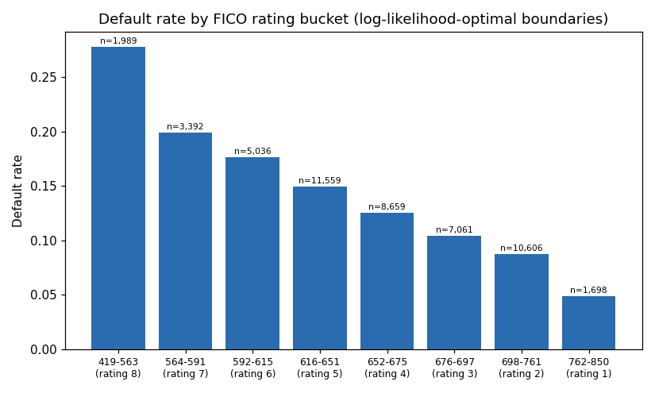

# Credit Risk Segmentation: PD Modelling + FICO Rating Buckets

A from-scratch implementation of two core retail-credit-risk techniques:

1. **Probability of default (PD) modelling** — logistic regression on
   borrower-level features.
2. **FICO score bucketing via dynamic programming** — collapsing a
   continuous FICO distribution into a small number of statistically
   distinct rating buckets by maximizing log-likelihood, rather than
   naive equal-width or equal-frequency binning.

The methodology mirrors the approach used in JPMorgan Chase's *Quantitative
Research* virtual simulation on Forage. **The data and code here are
independent work** — see the disclosure below.

## Results at a glance

| Metric | Value |
|---|---|
| Portfolio size | 50,000 synthetic borrowers |
| Overall default rate | 13.3% |
| PD model (logistic regression) test AUC | 0.70 |
| FICO rating buckets | 8, log-likelihood optimal |
| Default rate monotonicity across ratings | ✅ Strictly decreasing (verified) |



## Why dynamic-programming bucketing

Splitting a FICO distribution into equal-width or equal-frequency bins
ignores where default risk actually changes. This project instead treats
each candidate bucket's defaults as `Binomial(n, p)` and searches — exactly,
via dynamic programming — for the boundary set that maximizes total
log-likelihood across all buckets, subject to a minimum bucket size that
prevents the optimizer from carving out tiny, noise-driven buckets in
sparse regions of the score range. See [`src/fico_bucketing.py`](src/fico_bucketing.py)
for the implementation and [`tests/test_fico_bucketing.py`](tests/test_fico_bucketing.py)
for correctness checks.

## Repository structure

```
credit-risk-fico-segmentation/
├── data/
│   ├── generate_synthetic_data.py   # reproducible synthetic data generator
│   └── synthetic_loan_data.csv      # generated output (50,000 rows)
├── notebooks/
│   └── credit_risk_segmentation.ipynb  # full, executed walkthrough
├── src/
│   └── fico_bucketing.py            # DP-based bucketing (reusable module)
├── tests/
│   └── test_fico_bucketing.py       # unit tests
├── outputs/
│   ├── fico_rating_table.csv        # fitted rating boundaries + stats
│   └── default_rate_by_rating.png
└── requirements.txt
```

## Reproducing this

```bash
pip install -r requirements.txt
python data/generate_synthetic_data.py   # regenerate the dataset (seeded)
jupyter notebook notebooks/credit_risk_segmentation.ipynb
python tests/test_fico_bucketing.py      # run the test suite
```

## ⚠️ Data disclosure

**All data in this repository is synthetically generated** (seeded, fully
reproducible — see `data/generate_synthetic_data.py`). It is built to mirror
the *structure* of a typical retail-credit dataset (FICO score, credit
lines, income, debt, tenure, default outcome) so the methodology can be
demonstrated and shared publicly. **It is not real data from JPMorgan Chase,
Forage, or any other institution**, and contains no proprietary or
confidential information. The underlying default-generating process is a
logistic function of FICO score, debt-to-income, credit lines, and
employment tenure — chosen to produce economically sensible relationships,
not to represent any real portfolio.

## Limitations

- The PD model is a single 4-feature logistic regression; production credit
  models typically compare several specifications (WOE-binned logistic
  regression, gradient boosting) and calibrate against a scorecard.
- Rating boundaries are fit and evaluated on the same generated dataset here
  for demonstration purposes; on real data, boundaries should be fit on a
  training window and validated out-of-time before use.
- An AUC of ~0.70 reflects the amount of signal built into the synthetic
  data-generating process, not a claim about real-world PD model
  performance (though it is in a realistic range for application-level
  features alone).

## License

MIT — see [LICENSE](LICENSE).
